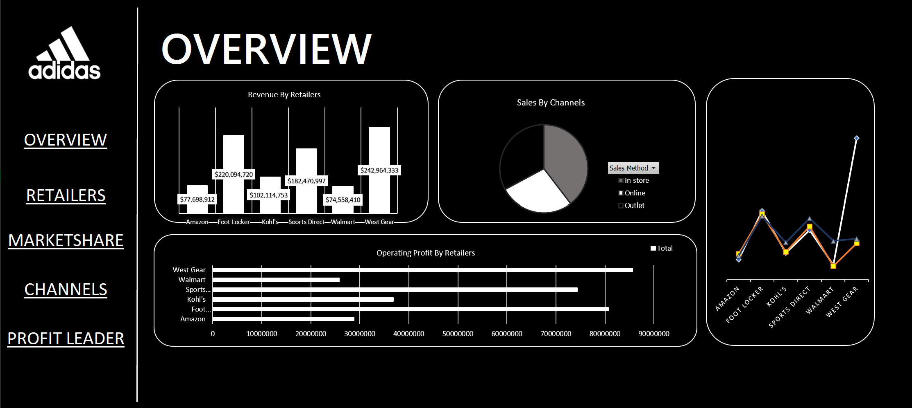
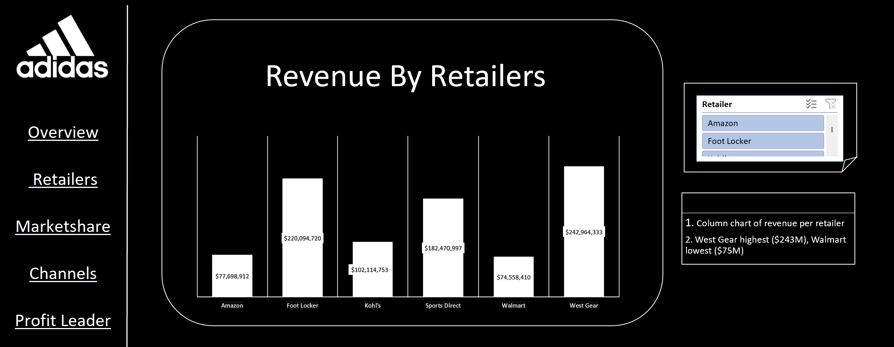
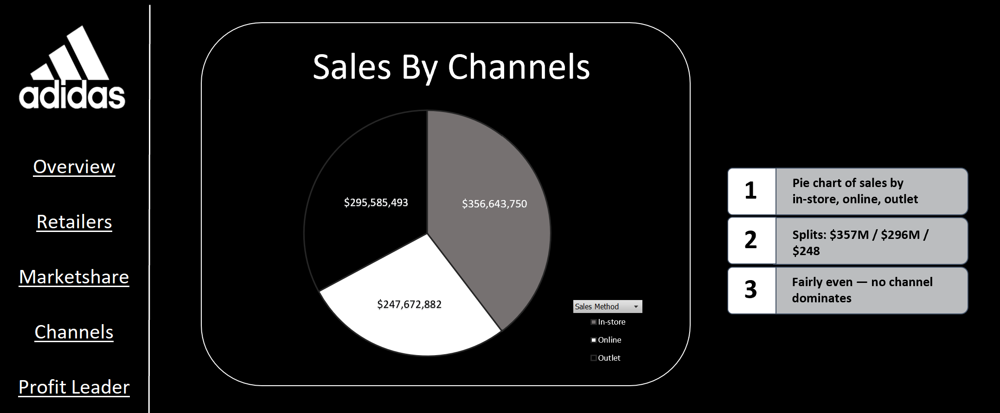
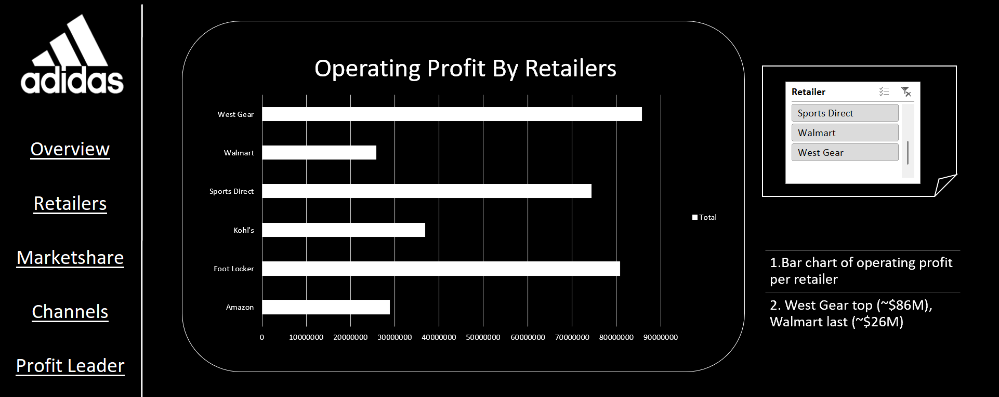
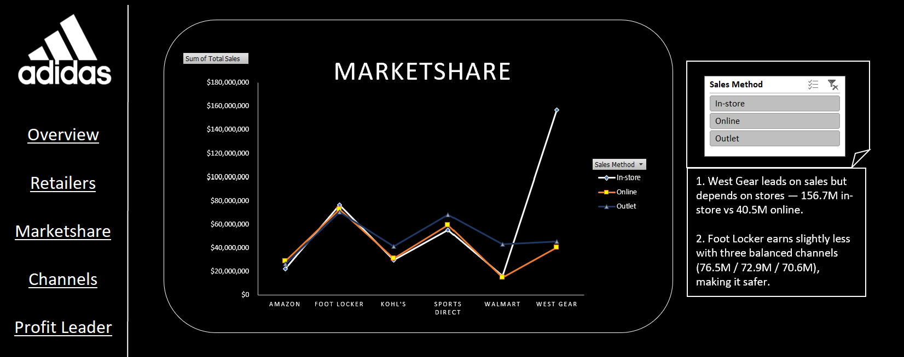

# 📊 Adidas Sales & Retail Performance Dashboard

An interactive Excel dashboard analyzing Adidas' sales performance across major retail partners and sales channels. Built with **PivotTables, PivotCharts, and Slicers**, the dashboard uses a dark-themed, brand-styled UI with clickable navigation buttons (Overview, Retailers, Marketshare, Channels, Profit Leader) linked to a shared PivotCache for seamless filtering across sheets.

---

## 🖼️ Preview

| Overview | Retailers |
|---|---|
|  |  |

| Channels | Profit Leader |
|---|---|
|  |  |

| Marketshare |
|---|
|  |

---

## 🧩 Pages / Sheets

| Page | Contents |
|---|---|
| **Overview** | Consolidated view: Revenue by Retailer, Sales by Channel, Operating Profit by Retailer, and Marketshare trend — all on one screen |
| **Retailers** | Column chart of total revenue per retailer, with a Retailer slicer for filtering |
| **Channels** | Pie chart breaking down total sales by In-store / Online / Outlet |
| **Profit Leader** | Bar chart ranking retailers by operating profit, with a Retailer slicer |
| **Marketshare** | Line chart comparing In-store / Online / Outlet performance across each retailer, with a Sales Method slicer |

---

## 🔍 Key Insights

- **Revenue leaders:** West Gear ($242.9M) and Foot Locker ($220.1M) are the top-performing retail partners; Walmart ($74.6M) and Amazon ($77.7M) generate the least revenue.
- **Sales channel mix:** Nearly balanced across channels — In-store ~$356.6M, Online ~$247.7M, Outlet ~$295.6M — with no single channel dominating.
- **Profitability:** West Gear also leads on operating profit (~$86M), followed closely by Foot Locker (~$81M); Walmart trails with the lowest operating profit (~$26M).
- **Channel dependency risk:** West Gear's strong sales are heavily concentrated in physical stores ($156.7M in-store vs. only $40.5M online) — a potential over-reliance risk if in-store traffic declines.
- **Most diversified retailer:** Foot Locker earns slightly less overall but spreads revenue evenly across all three channels (~$76.5M / $72.9M / $70.6M), making it the most balanced and lower-risk revenue stream.

---

## 🛠️ Tools & Techniques Used

- PivotTables & PivotCharts (Column, Bar, Pie, Line)
- Report Connections / shared Slicers across sheets
- Custom dark UI theme with shape-based navigation menu
- Dynamic data labels and callouts

---

## 📁 Repository Structure

```
├── Adidas_Sales_Dashboard.xlsx
├── adidas_overview.png
├── adidas_retailers.png
├── adidas_channels.png
├── adidas_profit_leader.png
├── adidas_marketshare.png
└── README.md
```

---

## 💡 Skills Demonstrated

- Data modeling with PivotTables
- Interactive dashboard design (slicers, navigation, theming)
- Business insight generation from visualized data
- Excel data visualization best practices (chart selection, labeling, layout)

---

## 👤 Author

**Tanvi Mehra**

- 🔗 LinkedIn: [linkedin.com/in/tanvi-mehra-9a148a26b](https://www.linkedin.com/in/tanvi-mehra-9a148a26b/)
- 📧 Email: [tanvimehra.05@gmail.com](mailto:tanvimehra.05@gmail.com)

Feel free to connect if you'd like to discuss the dashboard or collaborate on data analysis projects.
